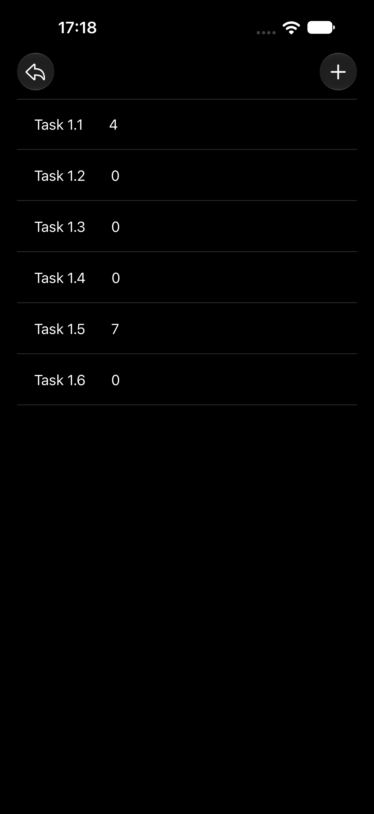
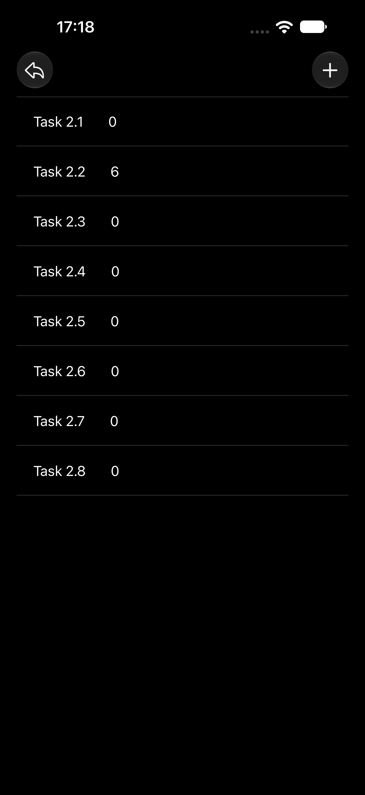

# Composite Реализация Паттерна
[](#)
[](#)
[](./LICENSE)
[](#)

> **Проект больше не поддерживается.**
> Оставлен как учебный для ознакомления и истории. 
> Код может быть неполным, устаревшим или содержать учебные упрощения.

Реализация паттерна проектирования **Composite** на языке **Swift** в рамках проекта.

<picture>
  <source media="(prefers-color-scheme: dark)" srcset="Screens/Screenshot_1_Dark.png">
  <source media="(prefers-color-scheme: light)" srcset="Screens/Screenshot_1_Light.png">
  
</picture>
<picture>
  <source media="(prefers-color-scheme: dark)" srcset="Screens/Screenshot_2_Dark.png">
  <source media="(prefers-color-scheme: light)" srcset="Screens/Screenshot_2_Light.png">
  
</picture>

## Описание
Разработано приложение, позволяющее на основе паттерна Composite строить иерархии вложенности файлов. Паттерн обеспечивает единообразную работу как с отдельными файлами, так и с их группами (папками), позволяя обрабатывать составные и конечные объекты через общий интерфейс.

## Возможности
- Построение древовидной структуры файлов и папок
- Единый интерфейс для работы с файлами и директориями
- Рекурсивная обработка вложенных элементов
- Добавление, удаление и обход элементов иерархии

## Применение паттерна
Паттерн Composite позволяет клиентскому коду одинаково взаимодействовать с простыми (файл) и составными (папка) объектами, что упрощает построение и обход древовидных структур произвольной вложенности.

## Пример использования
```swift
protocol Task {
    func run(completion: @escaping () -> Void)
}

final class ConcretTask: Task {
    public let name: String

    init(name: String) {
        self.name = name
    }

    public func run(completion: @escaping () -> Void) {
        print("start \(self.name)")
        DispatchQueue.main.asyncAfter(deadline: .now() + 0.5) { [weak self] in
            print("completed \(self?.name ?? "")")
            completion()
        }
    }
}

final class CompositeTask: Task {
    public let name: String
    public var tasks: [CompositeTask] = []

    init(name: String) {
        self.name = name
    }

    public func run(completion: @escaping () -> Void) {
        let dispatchGroup = DispatchGroup()
        for task in tasks {
            dispatchGroup.enter()
            task.run { dispatchGroup.leave() }
        }
        dispatchGroup.notify(queue: .main) {
            completion()
        }
    }
}
```